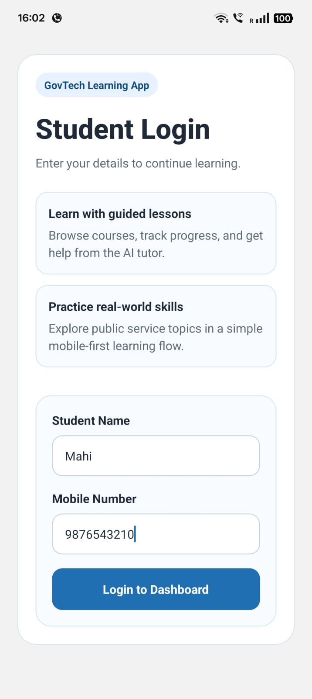
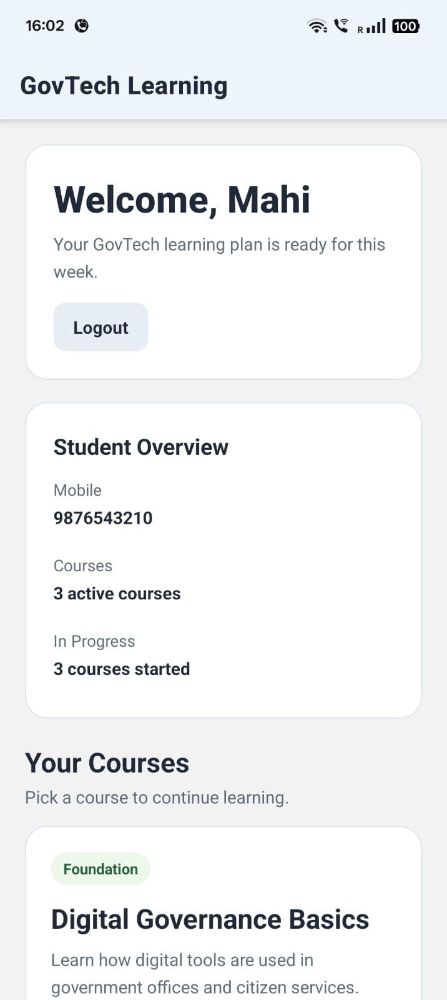
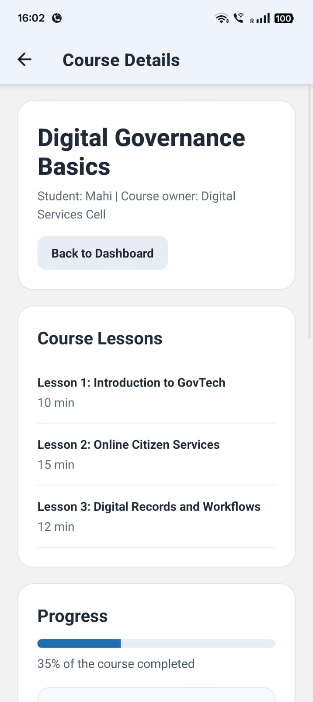
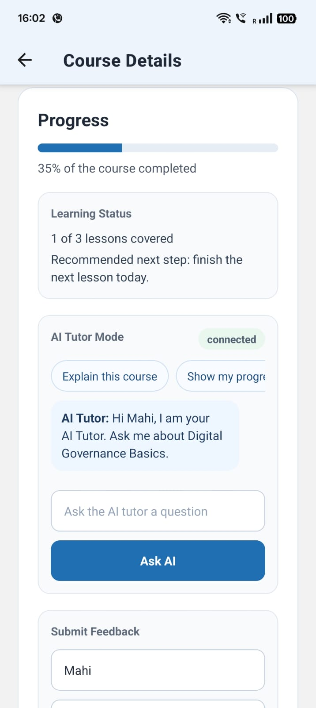
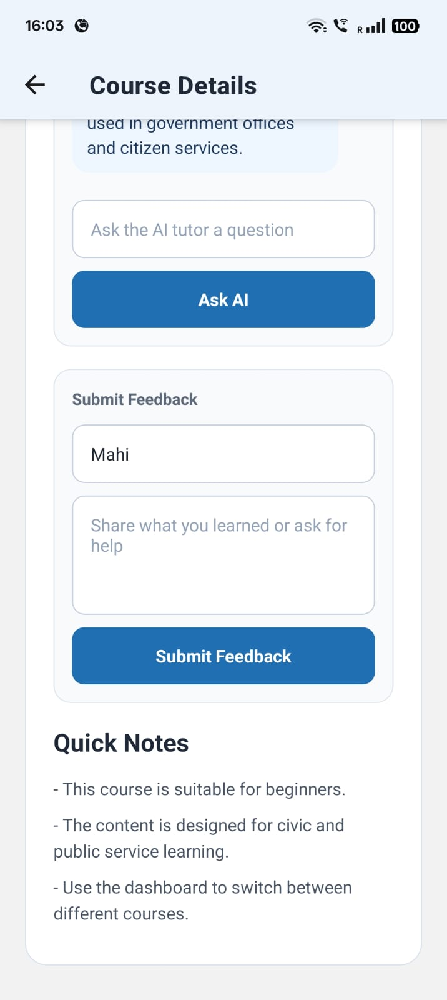
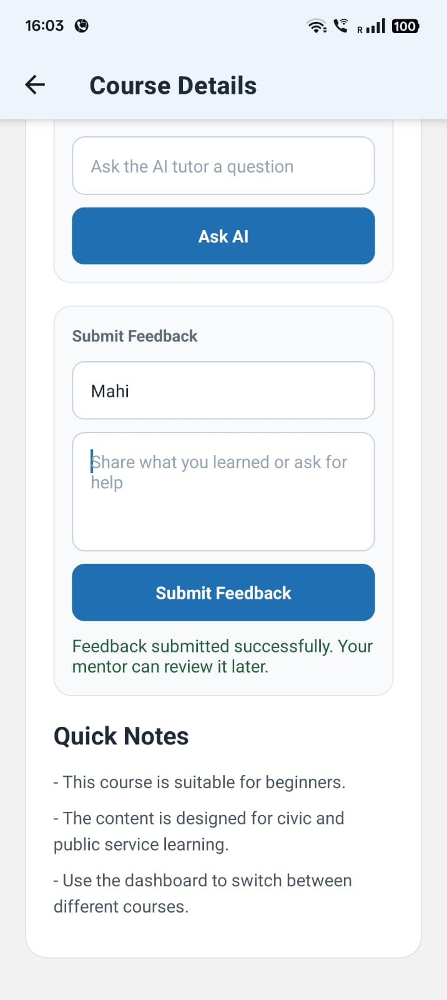
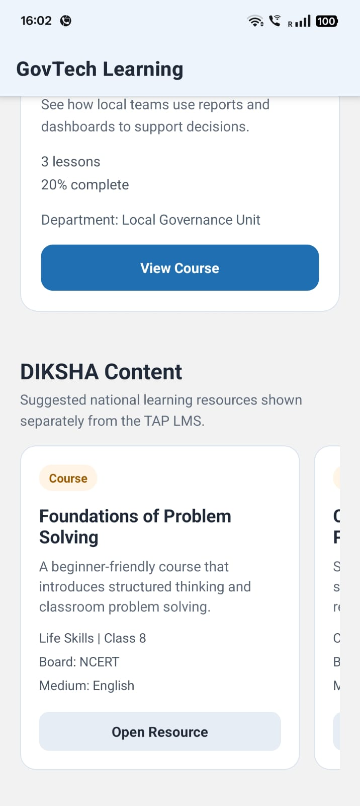

# Native GovTech Learning App for Public Education Systems

This repository currently contains a working frontend prototype for a GovTech learning platform. The original app in this repo was built as a simple React-based student flow with:

- student onboarding
- dashboard and course browsing
- course lesson and progress screens
- basic test coverage

For the DMP 2026 problem statement, this prototype should be treated as a product exploration layer, not the final technical solution.

## Problem Statement Alignment

The actual DMP 2026 project requires a mobile-first learning platform for The Apprentice Project (TAP) with:

- React Native Android application architecture
- Frappe LMS API integration
- AI Tutor chat over WebSockets
- offline-first support for low-connectivity environments
- DIKSHA-compatible content integration planning
- whitelisting architecture for external partner modules

This means the current web app is only a starting point for:

- understanding student flows
- validating screen structure
- shaping content and learning interactions

## Current Status

What is already useful in this repo:

- basic onboarding flow
- dashboard flow
- course detail flow
- clean component separation
- tests for login and navigation

## Features Implemented

- student onboarding with validation
- dashboard with course list and progress
- course detail screen with lessons
- mock AI tutor chat with local responses
- GET and POST API integration with mock fallback
- offline cache for course data
- offline queue for feedback submissions

## How To Run The App

```bash
npm install
npm start
```

Run tests:

```bash
npm test -- --watchAll=false --runInBand
```

Build the app:

```bash
npm run build
```

## Tech Stack Used

- React
- JavaScript
- CSS
- Fetch API
- React Testing Library
- Jest

What still needs to be built for the real project:

- native Android app scaffold using React Native
- API service layer for Frappe LMS
- authentication and student session flow
- WebSocket-based AI tutor messaging
- offline storage and sync strategy
- partner whitelisting module architecture
- DIKSHA integration exploration

## Recommended Architecture for the Real Project

Suggested React Native structure:

```text
app/
  src/
    screens/
      Onboarding/
      Dashboard/
      Course/
      TutorChat/
    components/
    services/
      api/
      websocket/
      storage/
    modules/
      lms/
      diksha/
      partners/
    state/
    utils/
    config/
```

Core modules:

- `services/api`: Frappe LMS REST integration
- `services/websocket`: AI tutor real-time chat
- `services/storage`: offline caching and sync queue
- `modules/partners`: whitelisted partner feature loader
- `modules/diksha`: DIKSHA interoperability layer

## Mid-Point Milestone Plan

The best realistic mid-point milestone for this project is:

1. Set up React Native Android project scaffold
2. Build student onboarding and login flow
3. Connect to Frappe LMS APIs for course and lesson retrieval
4. Show dashboard and lesson screens with live backend data
5. Add basic offline caching for course metadata

Expected mid-point output:

- working Android app scaffold
- end-to-end onboarding flow
- dashboard powered by Frappe backend
- documented API integration approach

## Suggested Implementation Phases

### Phase 1: Product and Architecture Setup

- finalize app navigation and screen map
- define API contracts with TAP backend
- set up React Native project structure

### Phase 2: LMS Integration

- fetch courses, lessons, progress, submissions
- map backend data to mobile-friendly models
- handle loading, retries, and error states

### Phase 3: Learning Interaction

- lesson detail
- assignments and submissions
- progress tracking
- feedback display

### Phase 4: AI Tutor

- WebSocket chat connection
- conversation history
- reconnect and timeout handling

### Phase 5: Offline and Deployment Readiness

- local caching
- sync queue for submissions
- low-network fallback flows
- DIKSHA and partner integration boundaries

## Why This Repo Still Helps

Even though this is not yet a React Native app, it still helps in the following ways:

- validates the core student journey
- provides reusable product thinking for screens
- gives a base for discussion with mentors
- helps estimate migration into React Native screens

## Honest Note for Selection

If you are using this repository for DMP 2026 selection, the strongest positioning is:

"I have already built and tested the core student flow as a working frontend prototype. I understand the actual problem requires migrating this into a React Native Android architecture with Frappe LMS integration, WebSockets, offline support, and modular partner enablement. My next step is to convert this validated flow into a native app scaffold and connect it to the TAP backend."

That is much stronger and more honest than claiming this repo already solves the full problem.

## Local Development

Install dependencies:

```bash
npm install
```

Run the app:

```bash
npm start
```

Run tests:

```bash
npm test -- --watchAll=false --runInBand
```

Build production bundle:

```bash
npm run build
```

## Next Best Step

The most important next step is not more web UI polishing. It is creating a proper React Native version with:

- shared product flow from this prototype
- backend integration plan
- architecture docs for offline, WebSocket, and partner support

See [docs/dmp-2026-plan.md](./docs/dmp-2026-plan.md) for a selection-focused implementation plan.

## Screenshots

### Login


### Dashboard


### Course


## Screenshots

### Login / Onboarding


Student login and onboarding flow.

### Dashboard


Main dashboard showing student overview.

### Courses List


List of available courses fetched from API.

### Course Detail


Detailed course view with content.

### Lessons


Lesson content inside a course.

### AI Chat


AI tutor chat interaction with responses.

### Feedback Form


Feedback submission form.

### Feedback Submitted


Successful feedback submission state.

### DIKSHA Content


DIKSHA-style educational content integration.
